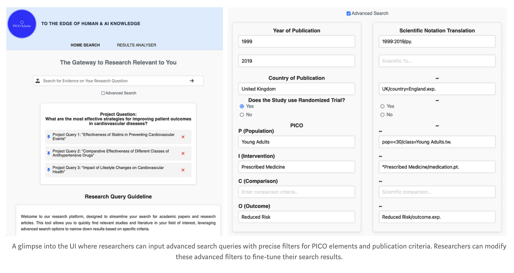
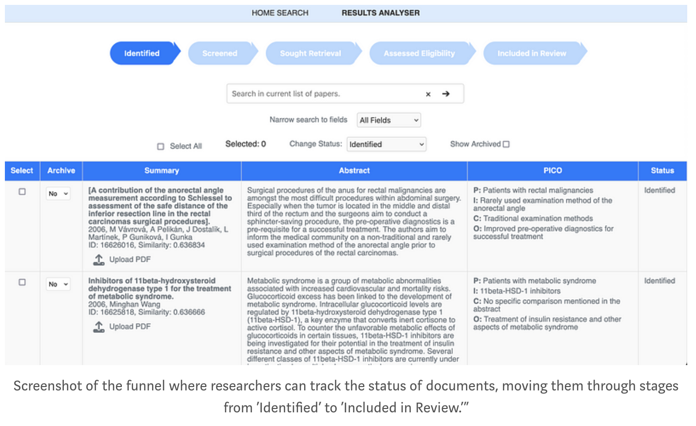

# PICO Scholar Project Overview 🚀

**PICO Scholar** is an AI-driven platform revolutionizing how researchers conduct systematic reviews by automating the extraction, categorization, and retrieval of PICO elements (Population, Intervention, Comparison, Outcome) from scientific documents. The platform is part of the [TiDB Future App Hackathon 2024](https://devpost.com/software/pico-scholar) (link contains DEMO video) and empowers researchers to efficiently manage large volumes of literature with precision and speed.

Explore our [launch blog](https://medium.com/@datagero/pico-scholar-poc-exploring-llms-role-for-systematic-literature-reviews-68ab9a1f4377) to discover how we built PICO Scholar, its core features, and how it enhances systematic literature reviews by guiding researchers' attention to the highest-value tasks.

PICO Scholar goes beyond basic PICO extraction by leveraging **fine-tuned models for semantic search** and **Retrieval-Augmented Generation (RAG)** systems, with future support for **re-ranking** based on relevance and user feedback. It integrates advanced engineering methods to automate routine tasks, allowing researchers to focus on high-value analysis and decision-making. By offloading time-consuming, manual processes, PICO Scholar maximizes the productivity and attention of researchers, enabling them to engage with the most critical studies while automating more mundane aspects of the review process.

With PICO Scholar, researchers can:

- **Search and Rank Documents** using fine-tuned semantic search models, retrieving the most relevant studies.
- **Extract PICO Elements** automatically from abstracts, providing concise, human-readable summaries.
- **Apply Custom Filters** with scientific notations for more accurate search results.
- **(Coming Soon) AI-Powered Re-Ranking** to enhance search precision and relevance.
- **(Coming Soon) AI Feedback Loops** that continuously refine classification and retrieval processes through user input.

## Screenshots

### Search Screen


### Funnel Screen



## Important Note on Setup

To use the code in its current version, you **must set up a TiDB cluster** and configure the respective environment variables in the `.env` or Gitpod files. Additionally, you'll need to run the code locally to ingest data into TiDB. 

- Example CSV files with abstracts are available in the `backend/datalake` folder to help you get started.
- Please refer to the [Backend README](./backend/README.md) for more detailed information about the ingestion pipelines and the general process.

## Gitpod Setup

Gitpod was initially made available for the judges of the hackathon. In its current form, it will spin up a UI, but since it doesn't have pointers to data or API keys, the app will not be functional out of the box. However, the Gitpod setup can still be useful if you wish to **fork the repository** and add your own credentials and data privately.

## Try it!

You can explore the project through Gitpod by clicking the button below:

[](https://gitpod.io/new/#https://github.com/datagero/pico-scholar)

Set the following environment variables for full functionality:
```sh
TIDB_PASSWORD=<your-tidb-password>
OPENAI_API_KEY=<your-openai-api-key>
```

## For Local Development

1. **Set up environment variables**:
   Create a `.env` file in the project root with the following variables:
   ```sh
   OPENAI_API_KEY=
   TIDB_HOST=
   TIDB_USERNAME=
   TIDB_PASSWORD=
   TIDB_PORT=
   TIDB_DB_NAME=
   MYSQL_HOST=127.0.0.1
   MYSQL_USERNAME=root
   MYSQL_PASSWORD=my-secret-pw
   MYSQL_PORT=3306
   MYSQL_DB_NAME=docker_test
   PYTHONPATH=./backend:./backend/serverfastapi
   ```

2. **Run Docker Compose**:
   The first time, we need to create a network
   ```sh
   docker network create mynetwork
   ```

   To build and spin up the containerized app, run:
   ```sh
   docker-compose up --build
   ```

3. Alternatively, spin up the individual components

### Front-end Setup
Navigate to `frontend/lamatidb` and run the following commands:
```
npm install
npm start
```
Access the frontend at `localhost:3000`.

### Back-end Setup

First, start the MySQL container:
```
export MYSQL_ROOT_PASSWORD=my-secret-pw
docker run --name mysql-container -e MYSQL_ROOT_PASSWORD=$MYSQL_ROOT_PASSWORD -v $(pwd)/mysql_data:/var/lib/mysql -p 3306:3306 -d mysql:latest
```

Then, start the FastAPI server:
```
fastapi dev backend/serverfastapi/main.py
```

### Connect to MySQL Database

You can connect to the MySQL database with:
```
mysql -h 127.0.0.1 -P 3306 -u root -p
```

## Project Structure

- **Backend**: The API and data processing logic (see `/backend/README.md` for more details).
- **Frontend**: React-based interface for managing research queries and document reviews.

# Contributors

PICO Scholar aims to evolve by integrating live model training, improving search granularity, expanding to new domains, and enhancing collaborative features for team-based research. The long-term vision is to transform systematic reviews across various disciplines by leveraging AI to enhance efficiency and accuracy.

If you'd like to contribute or learn more, reach out at datagero@outlook.com.

By: Matias V, Cristina DeLisle, Ben K, Will Gleason

